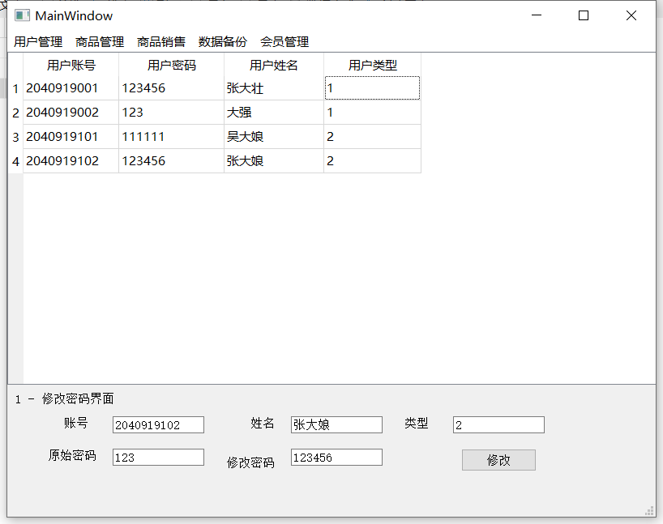

# MarketManagementSystem
基于C++ QT 的小型超市管理系统  ODBC 链接数据库
## 概要设计
（1）系统总体框图 

（2）各部分功能分析 

### 1.用户管理： 

##### (1)注册账号界面：默认查询用户信息，所有可通过输入（账号、密码、姓名、用户类型）来注册管理人员以及柜台人员；

##### (2)支持修改密码输入（账号）;

##### (3)重新登录进入到登录界面。

### 2.商品管理界面：

##### (1)查看商品信息：提供查看商品信息的操作，若不进行输入，则显示所有商品信息。

##### (2)进货管理：默认查看所有供应信息，提供货物供应操作，并更新goods,suply_manage以及suply表（将先判断是否是已有供应商，若不是已有供应商，则首先进行供应商的添加，若是已有供应商，直接添加到供应管理表以及商品管理表中）

### 3.销售管理：

##### (1)商品结账：默认显示所有商品；提供售卖指定商品的操作

##### (2)商品销售统计：

